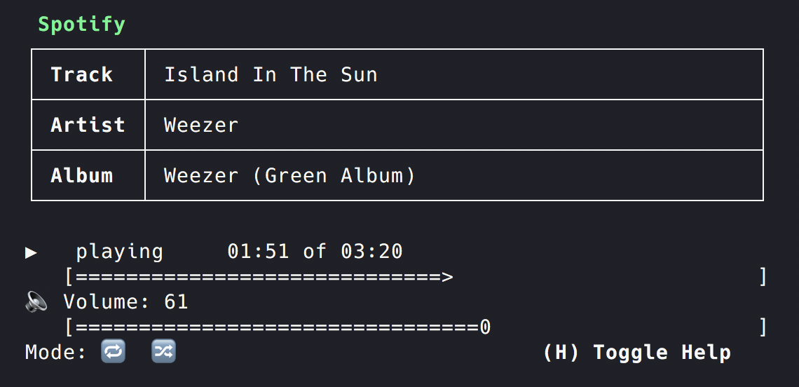

# mac_spotify_terminal



## Purpose

`curses`-based user interface to allow controlling and monitoring Spotify from the command line using only the keyboard. It can be used in a window as small as 40x5 characters (14 character height required for full functionality).

### Features

- View currently playing song, artist, and album
- View current position in song and song length, as well as player status
- View and control player volume
- View and control repeat/shuffle mode
- Pause, play, and change the currently playing song

### How to install

```
pip3 install https://github.com/asinghani/spotify_tui
```

### How to use

Launch using: `spotify_tui`

On small screens, press `Z` to enable automatic horizontal scroll of track/artist/album.

Useful Key Commands:

| Action            | Key   |
|-------------------|-------|
| Play              | Space |
| Next Track        | N     |
| Previous Track    | B     |
| Restart Track     | C     |
| Shuffle           | S     |
| Repeat            | R     |
| Volume Up         | +/=   |
| Volume Down       | -     |
| Scroll Track Info | Z     |
| Quit              | Q     |
| Show Help Menu    | H     |

